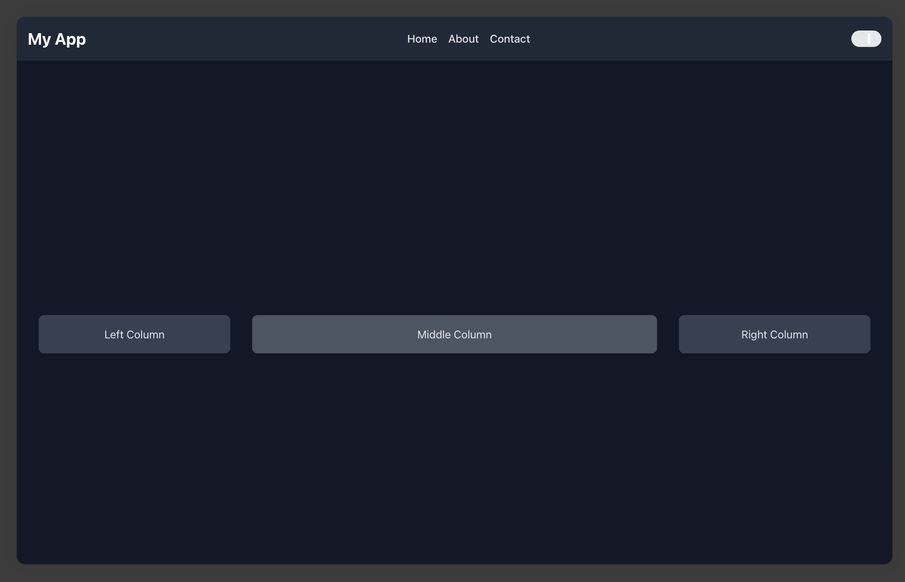

# C++ Fullstack Boilerplate

This project is a C++ full-stack boilerplate designed for creating REST APIs and embeds a static web apps. It leverages modern C++ for backend API development and supports serving static frontend applications. It includes essential features to get started quickly with both API and web development, while following a containerized development workflow with Docker.

## Table of Contents

- [Project Structure](#project-structure)
- [Key Features](#key-features)
- [Prerequisites](#prerequisites)
- [Installation and Usage](#installation-and-usage)
- [Environment Variables](#environment-variables)
- [Docker Configuration](#docker-configuration)
- [Contributing](#contributing)
- [License](#license)

## Project Structure

```
.
├── CMakeLists.txt              # CMake configuration for C++ build
├── app-dev.env                 # Development environment variables
├── docker-compose.yml          # Docker Compose configuration
├── include/                    # C++ header files
├── src/                        # C++ source files
└── www/                        # Frontend application (React/Vite/TypeScript)
    ├── dist/                   # Build output directory for frontend
    ├── public/                 # Public assets
    ├── src/                    # Frontend source code
    └── package.json            # Frontend dependencies and scripts
```

## Key Features

- **REST API with Modern C++**: Implements HTTP REST endpoints using `Boost.Beast`.
- **Static Frontend Support**: Hosts and serves static frontend applications built with React and Vite.
- **Database Abstraction**: Support for SQLite and PostgreSQL with interchangeable database interfaces.
- **Containerized Development**: Docker and Docker Compose for easy setup and deployment.
- **Authentication Helpers**: Provides helper utilities for authentication (e.g., session management).
- **Static Code Analysis**: Integrated ESLint for code linting and Tailwind for styling the frontend.

## Prerequisites

Make sure you have the following installed:

- **Docker** and **Docker Compose**: For containerized environments.
- **C++ Compiler**: A modern C++ compiler like GCC or Clang.
- **Yarn**: For frontend package management.
- **CMake**: To build the C++ project.

## Installation and Usage

### Starting the Application

To start the full application (frontend + backend) using Docker, simply run:

```bash
make all
```

This command will:

1. Install and build the frontend using Yarn.
2. Spin up the backend and frontend containers via Docker Compose.

### Stopping the Application

To stop the running containers:

```bash
make down
```

### Cleaning Up Build Artifacts

To remove the build artifacts for the frontend:

```bash
make clean
```

### Test the app (REST Api)

```shell 
curl http://localhost:8080/hello
```

### Test the app (Front End)



### Environment Variables

You can configure the environment by modifying the following files:

- `app-dev.env`: Environment variables for the development environment.
- `docker-compose.yml`: Docker configuration that references environment variables for services.

**Key Variables:**

- `DATABASE_URL`: Connection URL for PostgreSQL or SQLite.
- `PORT`: The port on which the backend API runs (default: `8080`).

## Docker Configuration

- `Dockerfile`: Used for production deployment.
- `Dockerfile.dev`: Used for development with live-reload features.
- `docker-compose.yml`: Defines services and networking for the containers.